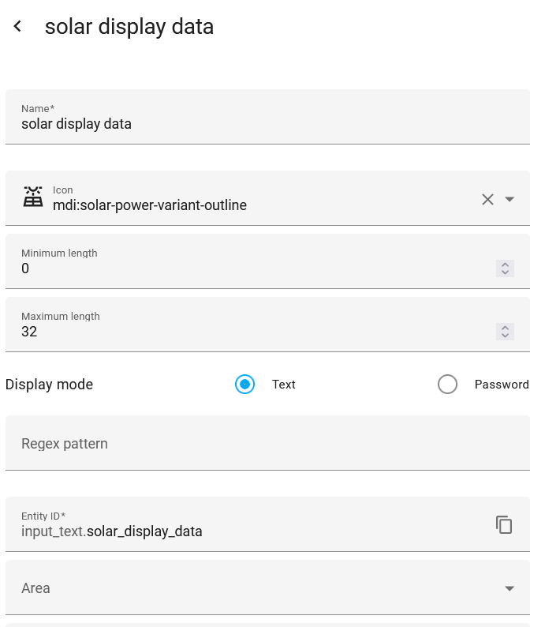
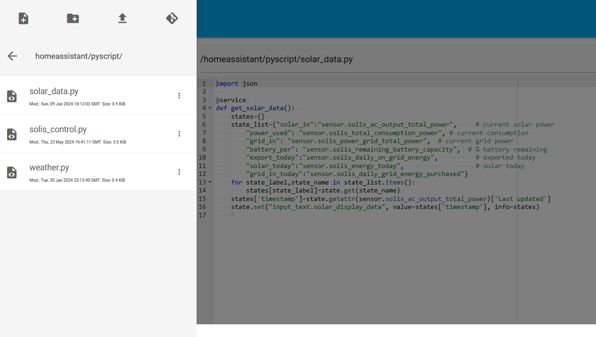
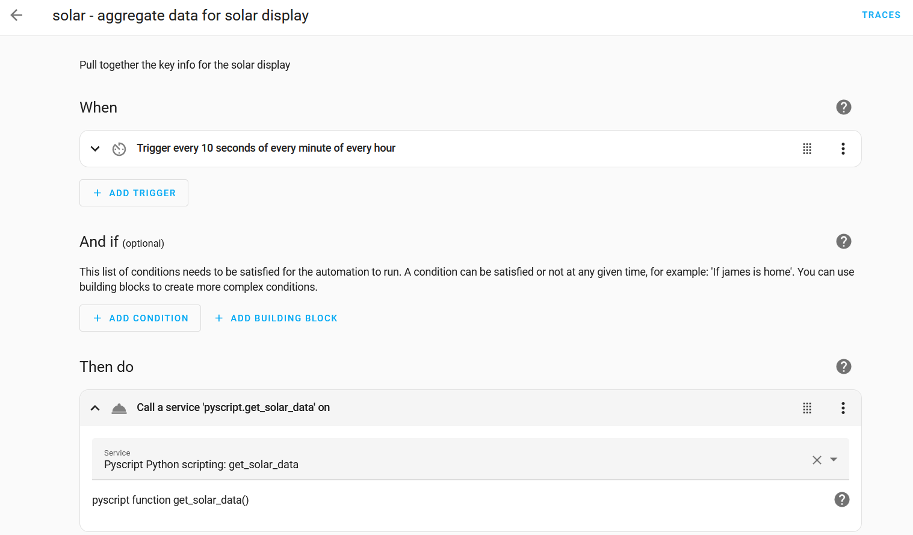

# Solis Cloud API display for ESP32

A version of a Solis Cloud API solar display using MicroPython and a [Cheap Yellow Display](https://github.com/witnessmenow/ESP32-Cheap-Yellow-Display)

It uses [PyScript](https://hacs-pyscript.readthedocs.io/en/latest/) to read data from the [Solis Sensor](https://github.com/hultenvp/solis-sensor/) HACS integration on Home Assistant and store it as JSON for the display to call in one go.

### Requirements
As the branch suggests, this needs Home Assistant to be installed, and a long lived access token (from your user profile at the bottom of the 'Security' tab)

It also needs PyScript to be installed - more on tha later.

## Hardware
Here's what I used to make my version:
- [Cheap Yellow Display - look for ESP32-2432S028R](https://www.google.com/search?q=ESP32-2432S028R)

It's around £10 and has everything I need.

## Software

### Loading the code

To get this working you'll first need to install MicroPython on your device. The instructions at [docs.micropython.org](https://docs.micropython.org/en/latest/esp32/tutorial/intro.html) are clear and easy to follow.

I use Microsoft [Visual Studio Code](https://code.visualstudio.com/) with the [Pymakr-preview](https://marketplace.visualstudio.com/items?itemName=pycom.pymakr-preview) extension installed (**note:** it's the preview version that, at time of writing, actually works. For some reason the standard version doesn't!)

It should be fairly straightforward to copy the code to the device.

### Configuring Home Assistant

You'll need to do the following:

#### Add the Solis integration
This can be found in the [HACS](https://hacs.xyz/) repository - details on how to set it up and configure it are [here](https://github.com/hultenvp/solis-sensor/).

#### Add the PyScript integration
This is another HACS integration - details are [here](https://hacs-pyscript.readthedocs.io/en/latest/)

#### Create a helper
Create a text helper called `input_text.solar_display_data`:

#### Copy the pyscript file
The `solar_data.py` file should be copied to the `homeassistant/pyscript` directory:

#### Create an automation that calls the pyscript service once every minute

This is done using 'Call Service' action

### Libraries used
I made use of the following excellent libraries - and I'm grateful to the developers for making my life so much easier!

- Wifi Captive Portal - [github.com/anson-vandoren/esp8266-captive-portal](https://github.com/anson-vandoren/esp8266-captive-portal) - ([*blog post*](https://ansonvandoren.com/posts/esp8266-captive-web-portal-part-1/))
- Micropython library for ili9341 (including custom fonts) [github.com/rdagger/micropython-ili9341](https://github.com/rdagger/micropython-ili9341) - [*homepage*](https://www.rototron.info/)

### How it works

#### boot.py
The `boot.py` section generally deals with setting the credentials for the wifi network and Solis API. It loads a captive portal with an SSID starting `SolarDisplay-` and once you've connected to it with a handy device and web browser, you can enter the appropriate information there. Once it's done, it should reset and start displaying the data.

#### main.py
This runs a bunch of uasyncio loops, mainly to make web service calls to Home Assistant every 45 seconds. While it's doing that, a blue dot appears at the bottom right of the screen. If it's successful, the dot disappears. If it's unsuccessful, it goes red.

Getting the HA pyscript function to combine all the output into one handy JSON file reduces the number of requests made to Home Assistant, which, itself, reducest the likelihood of a failed call - there's something a bit odd about requests running in a uasync function that I think can get itself into a bit of a tangle. I'm sure there's a better way of doing it, but this seems to be fairly reliable.

There are two buttons on the back of the display - one of them is a soft reset, the other, if you hold it for a few seconds it carries out a full reset, including settings. Also if the backlight is off (it's currently configured to turn it off after 11pm and back on at 6am) it turns it on for a brief time.

## 3D printed case

STLs and a 3MF file for the case can be found in the [3D models](docs/3D%20models/) section of the `docs` folder.
